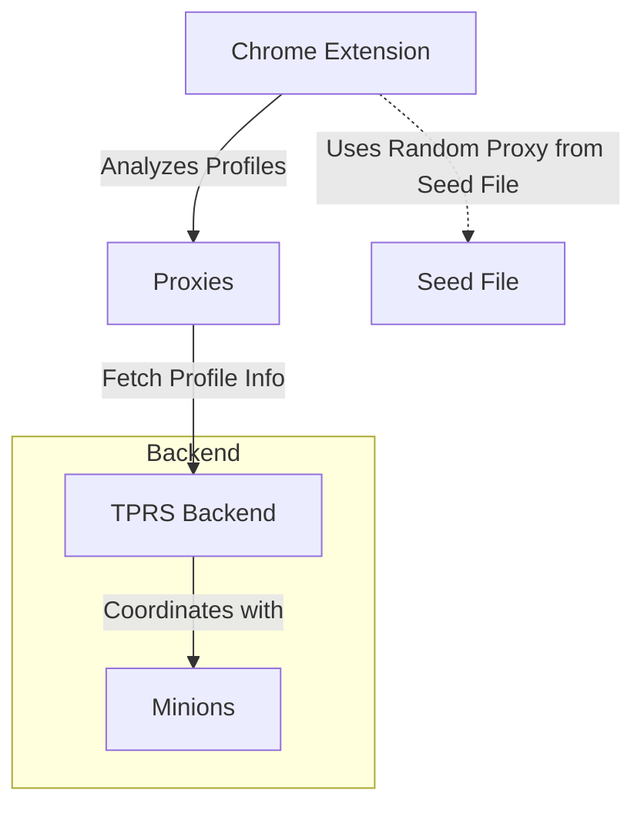

# Twitter Profile Analyzer

This project consists of two main components:
1. A Chrome extension for analyzing Twitter profiles
2. A backend server (TPRS) for storing profile data
3. A minion to fetch profile info
4. A proxy to serve public requetes.

The proxies contact TPRS for profile info and TPRS works with minions to fetch them. This ensures main TPRS can be hidden behind proxies and not get overloaded. There is a seed file that is published at well know location and the plugin picks a random proxy server from the seed file.


## Project Structure

```
.
├── extension/          # Chrome extension files
│   ├── manifest.json
│   ├── popup.html
│   ├── popup.css
│   ├── popup.js
│   ├── content.js
│   └── styles.css
│
└── server/            # Backend server files
    ├── package.json
    └── server.js
    └── minion.js
```

## Installation

### Chrome Extension
1. Open Chrome and navigate to `chrome://extensions/`
2. Enable "Developer mode"
3. Click "Load unpacked"
4. Select the `extension` directory

### Backend Server
1. Navigate to the server directory:
   ```bash
   cd server
   ```
2. Install dependencies:
   ```bash
   npm install
   ```
3. Start the server, it read configuration from server.config.js:
   ```bash
   npm start
   ```
3. Start the a minion, it read configuration from minion.config.js:
   ```bash
   node minion.js
   ```
3. Start a proxy, it read configuration from proxy.config.js:
   ```bash
   node proxy.sh
   ```   

## Configuration

Click the extension icon in Chrome to:
- Set the TPRS server URL
- Configure color schemes for different account age ranges
- Customize background colors

## Architecture

- Chrome Extension: Monitors Twitter pages and applies visual changes
- TPRS Server: Stores profile data and displayName history using SQLite
- Minion: Fetches profile info
- Proxy: Serves profile info to the content.js page.
- Settings: Stored in Chrome's sync storage

## Database Schema

```sql
profiles:
  - username (TEXT PRIMARY KEY)
  - displayName (TEXT)
  - joinedDate (TEXT)
  - lastUpdated (TEXT)

displayNameHistory:
  - id (INTEGER PRIMARY KEY)
  - username (TEXT)
  - displayName (TEXT)
  - capturedAt (TEXT)
```