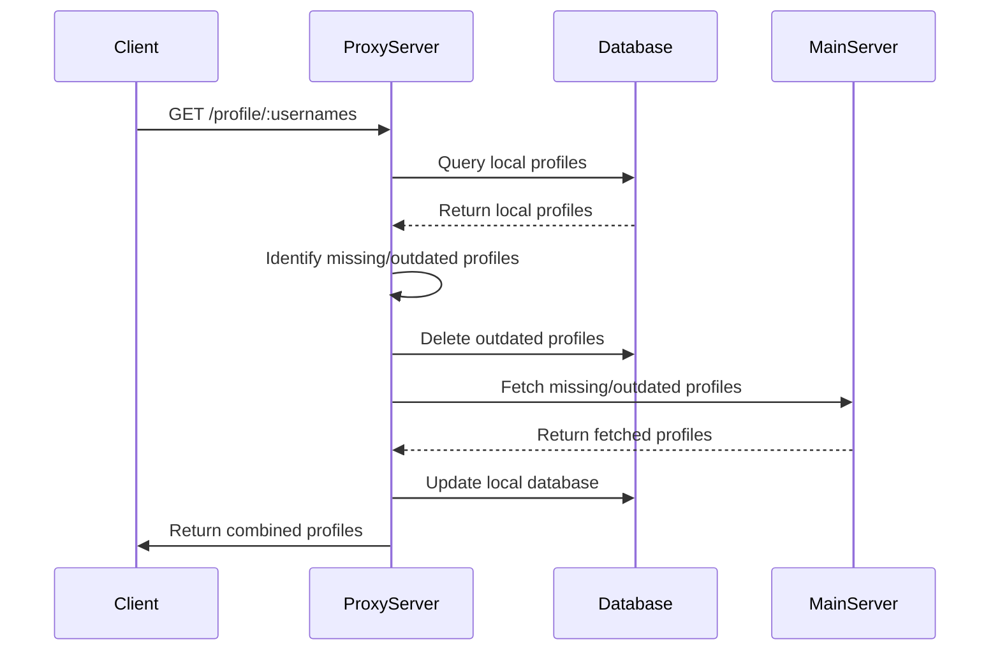

# Node.js Proxy Server Documentation

This document provides an overview of the proxy server code, its functionality, and database setup. The server is designed to handle profile data, fetch missing or outdated profiles from a main server, and store them in a local SQLite database.

## Features

- **Profile Proxying**: Fetches profile data either from the local database or a remote server.
- **Caching**: Stores profiles in a local SQLite database for faster access.
- **Profile Update Validation**: Deletes outdated profiles and fetches fresh data when needed.
- **Resilient Fetching**: Retries fetching profiles in case of errors.
- **REST API**: Provides a REST endpoint to query profiles.

## Configuration

The server reads its configuration from a JSON file (`proxy.config.json`). The configuration includes:

- **username**: Username for authentication with the remote server.
- **password**: Password for authentication.
- **serverUrl**: Base URL of the remote server.
- **maxAgeInDays**: Maximum allowable age for profile data in days.
- **port**: Port for the proxy server.

## Database Schema

The server uses SQLite for local storage with the following schema:

### Tables

1. **`profiles`**
   - `username` (TEXT, PRIMARY KEY): Unique identifier for a profile.
   - `joinedDate` (TEXT): Date the user joined.
   - `lastUpdated` (TEXT): Last updated timestamp for the profile.

2. **`displayNameHistory`**
   - `id` (INTEGER, PRIMARY KEY AUTOINCREMENT): Unique identifier for display name history entries.
   - `username` (TEXT): Associated profile's username.
   - `displayName` (TEXT): Display name of the user.
   - `capturedAt` (TEXT): Timestamp when the display name was captured.

---

## API Endpoints

### `GET /profile/:usernames`

Fetches profiles for the given usernames. Steps include:

1. Querying the local database.
2. Identifying missing or outdated profiles.
3. Deleting outdated profiles.
4. Fetching missing or outdated profiles from the main server.
5. Updating the local database.
6. Returning a combined list of profiles.

#### Request Parameters

- `usernames`: A single username or a comma-separated list of usernames.

#### Response

- JSON object containing profile data.


## Code Flow

### Sequence Diagram



## Helper Functions

### `isProfileOutdated(lastUpdated)`

Checks if a profile's `lastUpdated` timestamp is older than the configured `maxAgeInDays`.

### `queryLocalProfiles(usernames)`

Queries the database for profiles matching the provided usernames.

### `deleteOutdatedProfiles(usernames)`

Deletes profiles older than the configured `maxAgeInDays`.

### `fetchProfilesFromServer(usernames)`

Fetches profiles from the remote server using basic authentication.

### `updateLocalDatabase(profile)`

Inserts or updates the profile and display name history in the local database. Skips profiles with `null` `joinedDate`.

----------

## Error Handling

-   **Logging**: All errors are logged to the console for debugging.
-   **Retry Mechanism**: Retries fetching profiles from the server if the initial attempt fails, with a delay.

## Deployment

1.  **Install Dependencies**:
      
    ```bash
	npm install express axios better-sqlite3 cors
	``` 
    
2.  **Prepare the Database**:
    -   Create the SQLite database file and ensure it has write permissions.
3.  **Add Configuration File**:
    -   Place `proxy.config.json` in the root directory with necessary configurations.
4.  **Start the Server**:
    ```bash
	node server.js
	```   


## Example Configuration File: `proxy.config.json`

```json
{
  "username": "admin",
  "password": "password123",
  "serverUrl": "https://example.com/api",
  "maxAgeInDays": 30,
  "port": 3000
}
```

## Future Enhancements

-   **Authentication**: Add authentication for the proxy endpoint.
-   **Rate Limiting**: Implement rate limiting to handle high request volumes.
-   **Retry Logic**: Add support for exponential backoff in retry logic.
-   **Environment Variables**: Use environment variables for sensitive configuration data.


