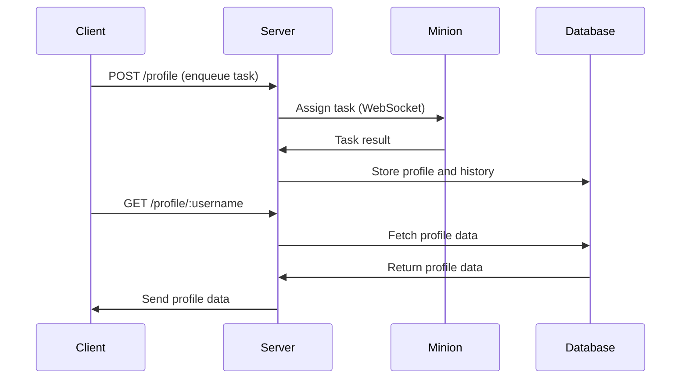

# Node.js Server Documentation

## Overview

This project implements a Node.js server that provides the following functionalities:
- REST API endpoints for managing profiles.
- WebSocket server for managing tasks distributed to connected "minions."
- SQLite database for storing profile data and display name history.
- Authentication for proxies and minions using basic auth.

## File Structure

```plaintext
.
+-- db/
¦   +-- profiles.db         # SQLite database file
+-- server.config.json      # Configuration file
+-- index.js                # Main server code (this file)
```

## Dependencies

- `express` - For creating REST API endpoints.
- `cors` - To allow cross-origin requests.
- `better-sqlite3` - SQLite3 database wrapper.
- `puppeteer` - For web scraping tasks (future usage).
- `ws` - WebSocket server.
- `fs` - File system module for reading configuration files.

Install dependencies using:

```bash
npm install
```

## Configuration

The server expects a configuration file (`server.config.json`) in the root directory:

```json
{
  "port": 4000,
  "minions": [
    {"username": "minion1", "password": "password1"}
  ],
  "proxies": [
    {"username": "proxy1", "password": "password1"}
  ],
  "maxTasksPerMinion": 5
}
```

## Database Schema

The SQLite database includes two tables:

```sql
CREATE TABLE IF NOT EXISTS profiles (
  username TEXT PRIMARY KEY,
  joinedDate TEXT,
  lastUpdated TEXT
);

CREATE TABLE IF NOT EXISTS displayNameHistory (
  id INTEGER PRIMARY KEY AUTOINCREMENT,
  username TEXT,
  displayName TEXT,
  capturedAt TEXT,
  FOREIGN KEY(username) REFERENCES profiles(username)
);
```

## Endpoints

### POST `/profile`
**Description:** Enqueue a profile task for processing.

#### Request:
- Headers: `Authorization` (Basic Auth for proxies)
- Body: `{ "username": "example" }`

#### Response:
```json
{ "success": true }
```

### GET `/profile/:username`
**Description:** Fetch profile data from the database.

#### Response:
```json
{
  "username": "example",
  "joinedDate": "2024-01-01",
  "lastUpdated": "2024-11-24",
  "displayNameHistory": [
    { "displayName": "Example", "capturedAt": "2024-11-20" }
  ]
}
```

## WebSocket Workflow

Minions connect to the server via WebSocket. Tasks are assigned from the queue to available minions.

### Workflow Diagram



## Authentication

### Proxies
- Authenticated using Basic Auth.
- Allowed to enqueue tasks via the `/profile` endpoint.

### Minions
- Authenticated using Basic Auth over WebSocket connections.

## Task Management

### Task Queue
- New tasks are enqueued if not already in queue or assigned.
- Tasks are distributed to minions with available capacity.

### Task Assignment
- Each minion has a maximum task capacity defined in `server.config.json`.

## Running the Server

Start the server:

```bash
node index.js
```

## Diagram of System Architecture

```mermaid
graph TD
    A[Client] -->|REST API| B[Express Server]
    B -->|Database Queries| C[(SQLite Database)]
    B -->|Task Management| D[Task Queue]
    D -->|Assign Tasks| E[Minions (WebSocket)]
```

